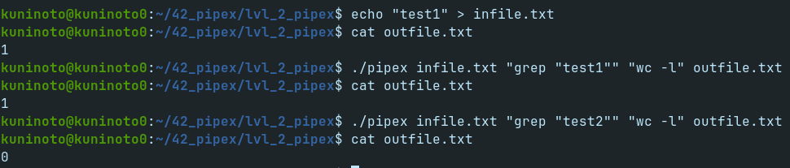

# pipex (42Porto - 42Cursus)  &nbsp; 

## Grade: Didn't submit
Pipex is a choice project and I've choosen minitalk; Therefore I'm unable to submit it. 
Done for consolidation of processes theme.

### Overview:
Given command line arguments in the format:
	./pipex <infile> <cmd1> <cmd2> <outfile>
_pipex_ replicates the pipe functionality of the shell.

###  Screenshot:

### Installing and running the project:

1- Clone this repository
	
	git clone https://github.com/Kuninoto/42_pipex
2- Navigate to _lvl_2_pipex_ and run `make`
	
	cd 42_pipex/lvl_2_pipex && make
3- `make clean` so that you don't keep those object files that you won't need anymore

	make clean
4- Run _pipex_ with your desired arguments

	./pipex <infile> <cmd1> <cmd2> <outfile>

###  Subject: [pipex en_subject](./extras/en.subject_pipex.pdf)

#### Makefile Available Targets:  
`make` or `make all` - Makes _pipex_  
`make clean` - Deletes all the resulting object files  
`make fclean` - Deletes _pipex_ and all the resulting object files  
`make re` - fclean + all  

## Useful links
[The fork() function in C](https://www.youtube.com/watch?v=cex9XrZCU14&list=PLfqABt5AS4FkW5mOn2Tn9ZZLLDwA3kZUY)  
[man dup, dup2](https://www.man7.org/linux/man-pages/man2/dup.2.html)  
[C program that demonstrates fork and pipe GeekForGeeks](https://www.geeksforgeeks.org/c-program-demonstrate-fork-and-pipe/)  
[Communicating between processes (using pipes) in C](https://www.youtube.com/watch?v=Mqb2dVRe0uo)  

## Disclaimer
> At [42School](https://en.wikipedia.org/wiki/42_(school)), almost every project must be written in accordance to the [Norm](./extras/en_norm.pdf), the schools' coding standard. As a result, the implementation of certain parts may appear strange and for sure had room for improvement.

---
Made by Nuno Carvalho (Kuninoto) | nnuno-ca@student.42porto.com  

 <a href="https://www.linkedin.com/in/nuno-carvalho-218822247"/> &nbsp;
